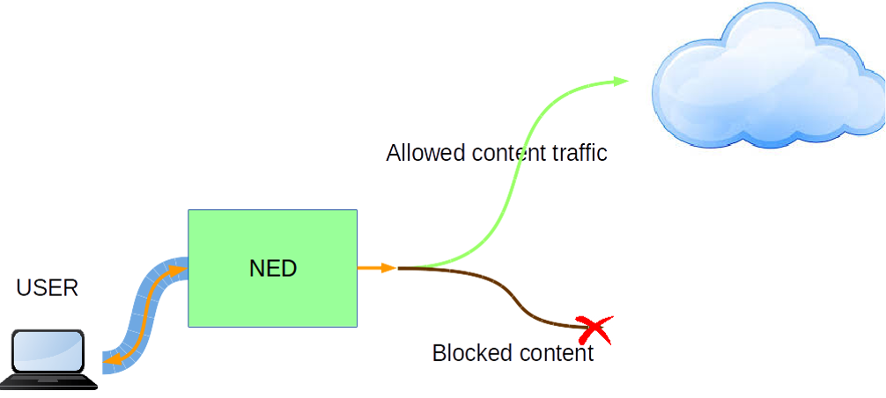
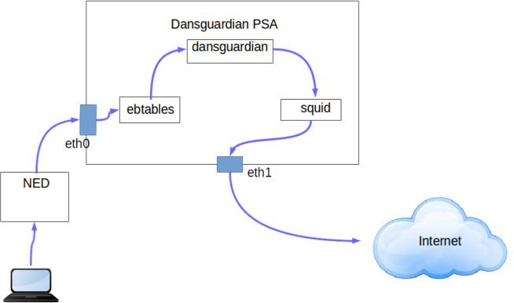

# 1. End-user 

## 1.1 Description / general readme

Today, thanks to the Internet we can easily and quickly, and usually without any restriction, access to information of any topic. This has meant, no doubt, a revolution in the field of knowledge with great benefits for society. However, there are disadvantages too. Easy access to the information that provides Internet also means that children can reach content not suitable for their age, an issue that arouses the concern of many parents.

This PSA tries to manage this problem, offering the user the possibility of blocking the traffic to some contents.




## 1.2 Features / Capabilities

This PSA is able to filter the unwanted sites defined by the user configuration. 

The internal used technologies are:
* Squid
* Dansguardian
* iptables
* ebtables
* jq

The list of capabilities are (extracted from manifest):

* Advanced_parental_control: offers the possibility of blocking some content types 

* TrafficInspection_L7: offers the possibility of blocking a website domain

## 1.3 Security policy examples

The following examples list some possibly policies that can be enabled from the SECURED GGUI.

```
father;enable;advance_parental_control;(type_Content,adolescent)
```

* This policy configures the dansguardian PSA to block the banned content for the "adolescent" profile. 

```
father;enable;advance_parental_control;(type_Content,child)
```
* This policy configures the dansguardian PSA to block the banned content for the "child" profile.

```
father;enable;advance_parental_control;(type_Content,pgr)
```
* This policy configures the dansguardian PSA to block the banned content for the "pgr" profile.

## 1.4 Support, troubleshooting / known issues

If you find any issue please contact us.

# 2. Developer / admin

## Description / general readme

The Dansguardian PSA pretends to offer the possibility to block all the traffic the user wants to block. The most clear example is the father who wants to manage the content his child can access to.

The PSA acts like a transparent proxy managed by both Dansguardian and Squid. Dansguardian offers multiple already public blacklists which can block many types of content while Squid is in charge to forbid the traffic to that kind of urls.  




## Components and Requirements

VM technology allows creating a full system for the PSA. The components used in this PSA are:

* Operative System: Debian 7 "wheezy"
* iptables 
* ebtables
* brigde-utils
* squid3
* dansguardian
* jq

There are no extra requirements apart from the correct user configuration passed to the PSA.

## Detailed architecture

There are several components in the internal architecture:

* **Inspect and route traffic**. **ebtables** is used to set up rules to inspect Ethernet frames between eth0 and eth1 and force the traffic to be routed instead of being just bridged. By this, the traffic will be routed through the Squid proxy. 

* **Filter the traffic**. **Squid and Dansguardian** check all the traffic, blocking it if the user configuration indicates it must be blocked.

### Rules

There are no rules

### Certificates

There are no needed certificates


## Virtual machine image creation

The procedure to create a valid PSA image from scratch start with the prerequisite instructions defined in  [PSA Developer guide](https://gitlab.secured-fp7.eu/secured/secured/blob/master/WP5/PSA_dev_guide.md) to obtain a valid base image for PSA. 

Install the software Squid:

	sudo apt-get install squid3

Install the software Dansguardian:

	sudo apt-get install dansguardian

Copy the necessary [files](https://gitlab.secured-fp7.eu/dmontero/psa-dansguardian/tree/master/PSA) of this project in the folder:

```
$HOME/phytonScript/
```

## Mobility Support
This PSA supports the mobility scenario.

## Support, troubleshooting / known issues

If you find any issue please contact us.

## Files required

No extra files required.

### PSA application image

PSA is based on a Virtual machine image in KVM- kernel module format ".qcow2". A [sample image has been included](https://vm-images.secured-fp7.eu/images/priv/PSA-dansguardian.img) in the project.

### Manifest
* XML 

The PSA manifest in format XML is available at [Manifest](NED_files/TVDM/PSAManifest/dansguardianPSA.xml).
This file must be stored in the PSAR. And reflects the capabilities described below. 

* JSON
The PSA manifest is available at [Manifest](NED_files/TVDM/PSAManifest/dansguardianPSA).


### HSPL

The HSPL format is defined as follows:

* D4.1 format:

```
father;enable;advance_parental_control;(type_Content,adolescent)
father;enable;advance_parental_control;(type_Content,child)
father;enable;advance_parental_control;(type_Content,pgr)
father;enable;advance_parental_control;(type_Content,universal)
father;no_authorise_access;Internet_traffic;(specific_URL,www.polito.it)
```

* More friendly:

```
I enable the advanced parental control using the Adolescent level
I enable the advanced parental control using the Child level
I enable the advanced parental control using the Pgr level
I enable the advanced parental control using the Universal level
I do not authorise access to the internet traffic to www.upc.edu
```

### MSPL

For this PSA we have defined four levels. Their differences are mostly based on the different kind of contents it blocks, sometimes more restrictive than others. This four levels are:
* [Child](https://gitlab.secured-fp7.eu/secured/spm/blob/devel/M2LService/code/M2LPluginDansguardian/MSPL_21842fa2-6b8e-4707-bb5e-55f01985eb22.xml)
* [Universal](https://gitlab.secured-fp7.eu/secured/spm/blob/devel/M2LService/code/M2LPluginDansguardian/MSPL_3966144e-88b9-45f4-a9de-fa73d02a3ed6.xml)
* [Adolescent](https://gitlab.secured-fp7.eu/secured/spm/blob/devel/M2LService/code/M2LPluginDansguardian/MSPL_4335dd7c-53c7-4e34-8d87-b3862966a6fa.xml)
* [Pgr](https://gitlab.secured-fp7.eu/secured/spm/blob/devel/M2LService/code/M2LPluginDansguardian/MSPL_f42787b6-587e-4588-aecc-d39126b3335b.xml)

### M2L Plug-in

The M2l plug-in is available at [M2LPlugin](https://gitlab.secured-fp7.eu/secured/spm/blob/devel/M2LService/code/M2LPluginDansguardian/src/eu/securedfp7/m2lservice/plugin/M2LPlugin.java)

This plugin generates different configurations depending on the level in the MSPL.

This plugin do not need additional external information in this version that must be store in the PSAR.

## Features/Capabilities

The list of capabilities are (extracted from manifest):

The list of capabilities are (extracted from manifest):

* Advanced_parental_control: offers the possibility of blocking some content types 

* TrafficInspection_L7: offers the possibility of blocking a website domain

## Testing

Testing scripts are available at [test folder](tests/)


# 3. License

Please refer to project LICENSE file.

This software incorporates Squid and Dansguardian and both are open source software licensed under the [GNU GPL](http://www.gnu.org/licenses/gpl-3.0.en.html).

# Additional Information 
## Partners involved

* Application: UPC
* MSPL: POLITO,UPC 
* M2L Plugin: UPC

# Status (OK/No/Partial) -*OK*-

# TODO:
* Tests
